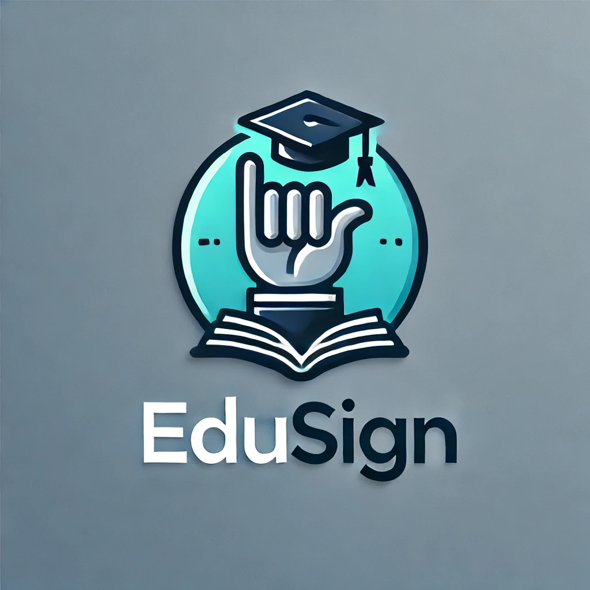
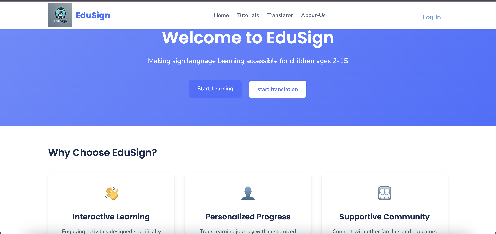
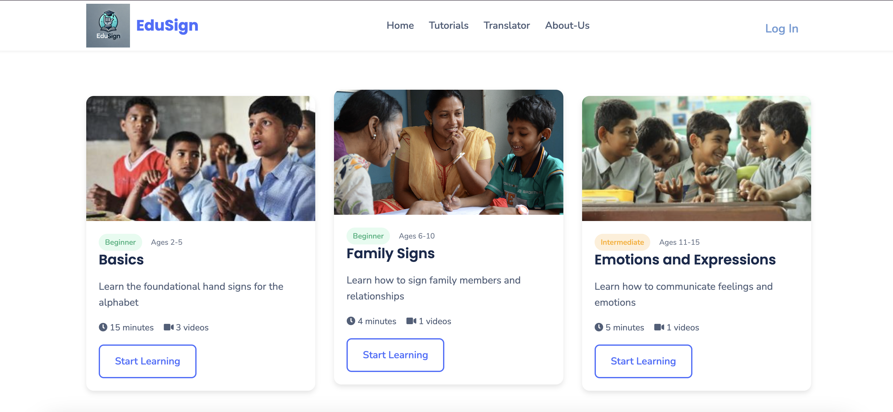

# EduSign - Sign Language Education Platform



**Breaking barriers, building bridges: Sign language at every child's fingertips.**

EduSign is an interactive sign language education platform designed to make sign language learning accessible to children ages 2-15. The platform features tutorials, quizzes, sign language recognition, and translation capabilities.

## 📸 Screenshots

### Home Page


### Tutorial Page


## 🌟 Features

- **Interactive Tutorials**: Age-appropriate sign language lessons categorized by difficulty level
- **Interactive Quizzes**: Test your sign language skills with webcam-based quizzes
- **Sign Translation**: Translate basic sign language gestures into multiple languages
- **Interactive Quizzes**: Test your sign language skills with webcam-based quizzes
- ****Sign Recognition**: Real-time recognition of numbers and letters in sign language using webcam.
- **User Authentication**: Create an account to track progress and access personalized content

## 📋 Technology Stack

### Frontend
- HTML, CSS, JavaScript
- EJS (Embedded JavaScript Templates)

### Backend
- Node.js with Express.js framework
- FastAPI for Python integration with the frontend.

### AI and Machine Learning
- TensorFlow for sign language recognition models
- MediaPipe for hand tracking and landmark detection
- Python FastAPI backends for processing sign language

## 🚀 Getting Started

### Prerequisites
- Node.js (v16+)
- npm or yarn
- Python 3.8+ (for the ML components)

### Installation

1. Clone the repository:
```bash
git clone https://github.com/your-username/edusign.git
cd edusign
```

2. Install Node.js dependencies:
```bash
npm install
```

3. Install Python dependencies for the sign recognition modules:
```bash
cd sign_recognitiom
pip install -r requirements.txt
```

4. Create necessary directories for models and data:
```bash
mkdir -p sign_recognitiom/models
mkdir -p sign_recognitiom/training_data
mkdir -p sign_recognitiom/translation_data
```

### Running the Application

1. Start the main Express server:
```bash
npm start
```

2. Start the FastAPI servers for sign language processing (in separate terminals):
```bash
# Sign language recognition API
cd sign_recognitiom
python main.py

# Sign language translation API
cd sign_recognitiom
python translate_api.py

# Numbers and letters recognition API
cd sign_recognitiom
python numbers_letters_api.py
```

3. Access the application at: `http://localhost:3000`

## 🏠 Project Structure

```
edusign/
├── public/               # Static assets
│   ├── assets/           # Images and other assets
│   ├── css/              # Stylesheet files
│   └── js/               # Client-side JavaScript
├── sign_recognitiom/     # Python ML modules
│   ├── models/           # Trained ML models
│   ├── training_data/    # Data for training recognition models
│   ├── translation_data/ # Data for training translation models
│   ├── main.py           # Main recognition API
│   ├── model.py          # ML model implementation
│   ├── translate_api.py  # Translation API
│   └── numbers_letters_api.py # Numbers & letters API
├── views/                # EJS templates
│   ├── partials/         # Reusable template parts
│   └── *.ejs             # Page templates
├── api.js                # Video library API
├── index.js              # Main Express server
├── package.json          # Node.js dependencies
└── README.md             # This file
```

## 🎓 Learning Paths

The platform offers learning paths for different age groups:

- **Ages 2-5**: Foundational sign language through play and images
- **Ages 6-10**: Building vocabulary and simple conversations
- **Ages 11-15**: Advanced concepts and everyday communication

## 🧠 Model Training

To train your own sign language recognition models:

1. Collect training data:
```bash
cd sign_recognitiom
python collect_data.py      # For numbers and letters
python collect_gesture_data.py  # For translation gestures
```

2. Train the models:
```bash
python train.py             # For numbers and letters model
python train_gesture_model.py   # For translation model
```

## 📱 Features Details

### Sign Language Recognition
The platform can recognize the following signs:
- Numbers: 1, 2, 3
- Letters: A, B, C

### Sign Language Translation
The platform can translate the following signs:
- Hello
- Thanks
- Yes

Translations are available in:
- English
- Hindi
- Kannada
- Telugu

## 👥 Contributors

- Amith K M - AI Developer
- Adarsh K R - Web Developer
- Prajwal K - Web Developer
- Chandana N M - Video Content Creator

## 📜 License

This project is licensed under the ISC License - see the LICENSE file for details.

## 🤝 Acknowledgements

- Thanks to all the contributors who have helped with the development
- MediaPipe for providing hand tracking capabilities
- TensorFlow for machine learning frameworks

---

Built with ❤️ for making sign language education accessible to all
